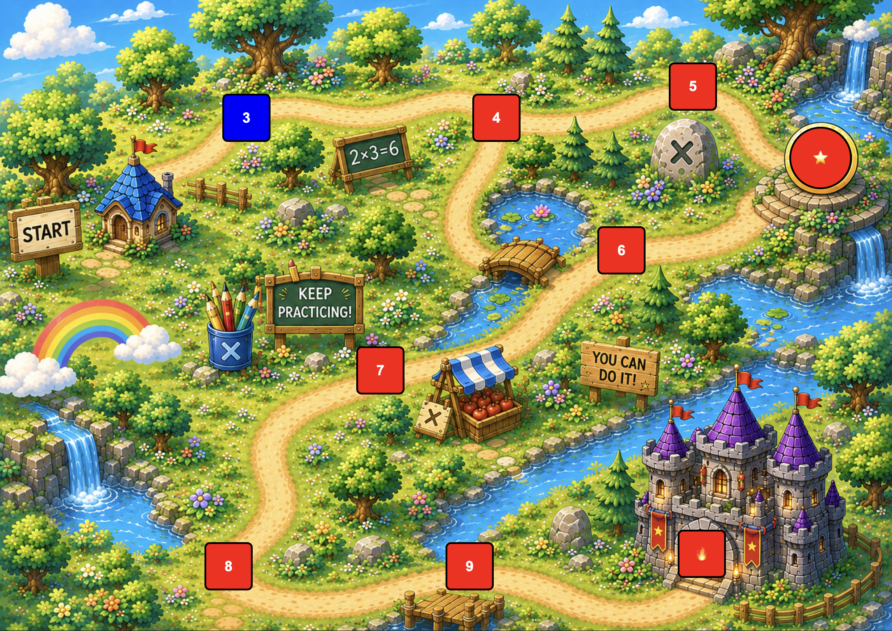
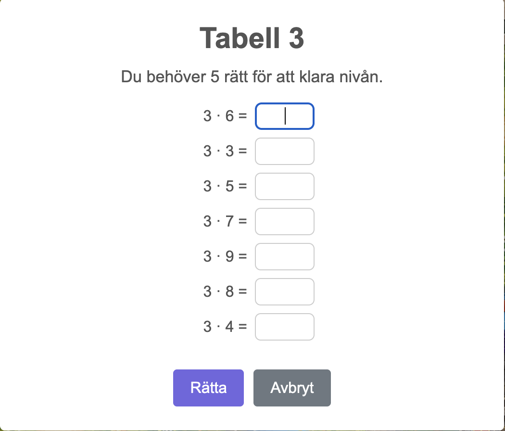
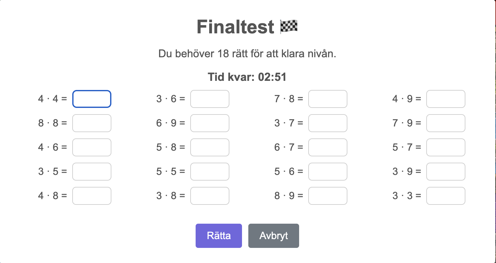

# Multiplication Adventure Game
A browser-based educational game designed to support multiplication practice
for middle school students through gamification principles such as progression,
feedback, autonomy and motivation.

Created by Rebecca Stenberg.

Originally developed as a theoretical gamification concept for the course
"Datorspel och lärande I" at Umeå Universitet, and later implemented independently as a
fully playable browser game.

## Play it here
[rjstenberg.github.io/maths_game/](https://rjstenberg.github.io/maths_game/)

Currently optimized for desktop/laptop browsers.

## Gameplay preview

  
   
  <em>Level progression and final boss challenge.</em>

  
   
  <em>Interactive world map with unlockable multiplication levels.</em>

  
   
  <em>First multiplication challenge.</em>

  
   
  <em>Final timed challenge combining all multiplication tables.</em>

## Game Systems
- Progression-based multiplication levels covering tables 3–9
- Unlockable world map structure inspired by platform game progression
- Immediate visual and textual feedback after each attempt
- Replayable practice levels with randomized question order
- Final timed challenge combining all multiplication tables
- Small motivational rewards such as stars, animals and confetti
- Reset functionality for repeated classroom use and testing

## Technical Details
- Built with HTML, CSS and JavaScript
- Browser-based responsive UI
- LocalStorage-based progression and save system
- SweetAlert2 for in-game feedback and dialogue windows

## Inspiration
- Based on an original gamification idea by Mathias Andersson
- Pedagogical input, discussions and classroom feedback provided by teachers Sophie Hansus and Mathias Andersson
- ChatGPT was used for background image generation, programming support and debugging

## Educational design
Spelifiering - Multiplikation på mellanstadiet

### Inledning och styrdokument
Den valda spelifieringen handlar om mängdträning för repetitiva uppgifter. Prototypen som
presenteras i denna text behandlar multiplikation på mellanstadiet, men samma design och
upplägg kan appliceras på annat material där fokus ligger på mängdträning. Målet med
spelifieringen är att väcka intresse och uppmuntra eleverna att träna multiplikation på ett lustfyllt
sätt.

Läroplanen beskriver att utbildningen ”_ska främja alla elevers utveckling och lärande samt en
livslång lust att lära_” (Skolverket, 2025). Den förklarar vidare att skolans uppdrag är att stimulera
eleverna att hämta in och utveckla kunskaper, samt att främja kreativitet, nyfikenhet och
självförtroende och viljan att lösa problem. En viktig grund för detta är att undervisningen ska
bygga på ett utforskande arbetssätt och bidra till elevernas lust att lära.

Kursplanen för matematik (Skolverket, 2025) förklarar att undervisningen ska ge eleverna möjlighet
att utveckla förståelse för matematiska begrepp och metoder. Eleverna ska även får erfarenhet av
att använda digitala verktyg och programmering som stöd för att utforska problem och genomföra
beräkningar och tolka data. För mellanstadiet innehåller kursplanen de fyra räknesätten och
förståelse för hur regler och samband mellan de naturliga talen fungerar.

Spelifiering kan ses som en metod för att arbeta mot såväl läroplanens som kursplanens mål.
Genom att integrera spelelement i undervisningen kan elevernas engagemang och uthållighet
stärkas. Den valda spelifieringen ligger väl i linje med matematikämnets mål om att utveckla
säkerhet i beräkningar. Dess digitala utformning kan dessutom bidra till att väcka nyfikenhet för
programmering och ytterligare matematiska begrepp.

### Spelifieringens utformning och motivering
I detta avsnitt beskrivs hur spelifieringen har utformats och hur de olika spelelementen kan förstås i
relation till pedagogiska perspektiv på motivation och lärande (Palmquist, 2018).

Palmquist (2018) betonar vikten av tydlighet kring mål och regler samt kontinuerlig återkoppling
som grundpelare i spelifiering (s. 17, 90). När elever tillägnar sig ny kunskap frisätts dopamin,
vilket ökar motivationen att fortsätta lära sig (s. 26). Genom att utforma materialet på ett lustfyllt
och lättbegripligt sätt, samt erbjuda återkommande återkoppling på avklarade uppgifter kan
elevernas motivation till livslångt lärande stärkas (s. 26) - ett mål som även lyfts fram i läroplanen
(Skolverket, 2025).

Spelifiering kan därmed ses som ett pedagogiskt verktyg som främjar kreativitet, ökat ägarskap
och tydlig struktur i undervisningen (Palmquist, 2018, s. 26).

#### Spelplan och struktur
Spelplanen består av en 2D-karta inspirerad av Super Mario och innehåller sju träningsnivåer, en
bonusnivå samt en finalnivå. Vid start är endast den första nivån, multiplikationstabell 3, tillgänglig
och markerad i blått. Övriga nivåer är låsta och visas i rött, vilket tydligt signalerar att de inte kan
väljas ännu.

Palmquist (2018) framhåller att förståelse för uppgiften och den egna förmågan att lösa den är
centralt för motivation (s. 18). Elevernas upplevelse av framsteg stärks när de kan överblicka sin
position i förhållande till målet. Inom förväntansteorin betonas vikten av att större mål delas upp i
mindre och hanterbara delar (s. 38). Mindre segment möjliggör återkoppling oftare som kan ge en
känsla av tillfredsställelse och håller igång uthålligheten (s. 56). Palmquist beskriver även hur
förloppsindikationer (visuella markörer som visar nuvarande status) ökar motivationen genom att
konkretisera progressionen (s. 121-122).

Den valda spelplanen ger därför en tydlig översikt av alla uppgifter, visar var målet ligger och gör
deltagarens progression synlig. Genom att dela upp multiplikationstabellerna i olika nivåer blir
innehållet mer överskådligt och mindre komplext. Ordningen på frågorna blandas om för varje nytt
försök, för att eleven ska lära sig svaren på frågorna och inte ordningen. Efter varje försök på en
nivå får deltagaren återkoppling, och framsteg visualiseras tydligt på kartan. Varje nivå har
dessutom klara regler och deltagaren kan direkt se hur många rätt som krävs för att klara nivån,
vilket stärker känslan av kontroll och målmedvetenhet. Spelplanen fungerar på så sätt som en ram
för elevens läranderesa och ett konkret stöd för att upprätthålla fokus och motivation.

#### Rättning och återkoppling
Palmquist (2018) betonar att återkoppling är en central del av lärande och motivation. Han
beskriver att elever behöver möjlighet för iteration, att testa igen och förbättra sin prestation tills de
når önskat resultat (s. 22, 87, 108). Spelifiering kan på så sätt stimulera elevernas vilja att förfina
sina kunskaper och färdigheter (s. 18).

Enligt Palmquist är snabb, tydlig och konstruktiv återkoppling avgörande för motivation och lärande
(s. 41, 100, 102). Återkoppling bör ges så snabbt som möjligt efter en handling och stegvis under
hela processen, med fokus framåt mot nästa delmål (s. 42). Detta skapar en så kallad
återkopplingsslinga, där handling leder till återkoppling, som i sin tur väcker motivation till fortsatt
arbete (s. 70).

I spel sker återkoppling ofta visuellt och direkt, till exempel genom färg, ljud eller symboler, vilket
gör den tydlig och hanterbar (s. 100). Palmquist framhåller även vikten av att återkoppling ska vara
berömmande, specifik och framåtriktad (s. 82, 120–121). Den bör fokusera på uppgiften snarare
än på individen och lyfta fram vad som fungerar samt vad som kan förbättras. Genom att betona framsteg snarare än resultat stärks elevens känsla av autonomi och kompetens, vilket främjar inre
motivation.

I den aktuella spelifiering ges återkoppling direkt efter varje försök och kombinerar visuella element
med text. Varje nivå avslutas med en tydlig respons: en grön bock visar att uppgiften är avklarad,
medan ett grått frågetecken markerar att nivån inte är godkänd. Texten inleds med rubriker som
”_Snyggt jobbat!_” eller ”_Bra försök, testa igen!_”, följt av information om vad som händer härnäst, till
exempel att en ny nivå låsts upp, att hela spelet är avklarat eller att ett nytt rekord har satts. Om
eleven inte nått full pott visas dessutom de rätta svaren, vilket hjälper eleven att förstå sina misstag
och komma ihåg vad som krävs för att lyckas nästa gång.

Även spelplanen förstärker återkopplingen genom visuella förändringar, en avklarad nivå ändrar
färg från blå till grön, och nya nivåer som blir tillgängliga går från röd till blå. Denna progression blir
därmed en del av återkopplingen i sig. Berömmet i spelifieringen fokuserar på ansträngning och
utveckling, snarare än på resultat. Misslyckanden presenteras med neutrala färger och språk för
att undvika att eleven känner sig misslyckad, och istället uppmuntra till ett nytt försök.
Formativ bedömning är ett område där spelifieringens principer överlappar med skolans
pedagogiska uppdrag. Skolverket (13 maj 2025) beskriver att bedömning i formativt syfte ska
användas för att följa och stärka elevens kunskapsutveckling genom att ge återkoppling som
hjälper dem att testa, misslyckas och försöka igen. På ett liknande sätt lyfter Palmquist (2018, s.
164) de centrala delarna av formativ bedömning som tydliga mål, kriterier och återkoppling - från
lärare, kamrater och självbedömning.

Spelifieringens snabba, visuella och uppmuntrande återkoppling kan därför ses som en form av
digitalt stöd för formativ bedömning. Den gör elevens progression synlig, ger möjlighet till direkt
reflektion och skapar förutsättningar för att utveckla en medvetenhet om det egna lärandet.

#### Banor och progression
För att motivera eleverna behöver uppgifter anpassas efter förmåga och utmaningen gradvis öka,
så att svårighetsgraden och elevens kompetens utvecklas i takt med varandra (Palmquist, 2018, s.
38, 99). Denna process kan beskrivas som en progressionstrappa, där tidigare erfarenheter
kopplas ihop och successivt leder till nya färdigheter (s. 70). Utvecklingen i spelifiering bör därför
spegla både elevens progression och materialets struktur, med en tydlig röd tråd och naturlig
koppling mellan delmomenten (s. 99). I en spelifiering kallas dessa konkreta uppgifter för uppdrag
och ger ofta en belöning i någon form (s. 117).

De olika banorna i den valda spelifieringen är utformade i en sammanhängande struktur kring
temat multiplikation. Varje bana representerar en multiplikationstabell, och svårighetsgraden ökar i
takt med att banor klaras och nya tabeller låses upp. På så sätt blir progressionen både synlig och
meningsfull för eleven. Alla avklarade nivåer är fortsatt öppna och kan användas för att fortsätta
träna.

Dessutom finns inslag av valfrihet som stärker känslan av autonomi och självbestämmande. Vägen
är utformad så att tabell 5 och 6 är valfria, där minst en behöver godkännas för att låsa upp en
bonusnivå. I bonusnivån får eleven möjlighet att lägga till ett djur på spelplanen, en personlig
belöning som kombinerar nyfikenhet och överraskning. Kombinationen av tydlig progression,
gradvis ökad utmaning och valfrihet stärker elevens känsla av kompetens och kontroll. Dessa faktorer är centrala för motivation och lärande, något som diskuteras vidare i avsnittet om inre
motivation och flow.

#### Diagnos och belöning
Palmquist (2018) beskriver att spel ofta ger möjlighet att återvända till materialet och förbättra sina
färdigheter, även när huvudmålet har uppnåtts (s. 78). Detta kallas ibland slutspel eller
bemästrande, där spelaren får förfina sin prestation snarare än bara uppnå ett slutresultat. Denna
fas aktiverar drivkrafterna meningsfullhet, autonomi och bemästrande och bygger på att kreativitet
och expertkunskap aktiverar varandra i en loop (s. 79).

Palmquist betonar också vikten av ett tydligt slut, där eleven får möjlighet att testa sina nyvunna
färdigheter och se resultatet av sitt arbete (s. 79). I spelifiering motsvaras detta ofta av en slutstrid,
vilket är en utmaning som sammanfattar och prövar de kunskaper som byggts upp under vägen (s.
137). För att detta ska vara motiverande behöver utmaningen vara relevant och ge mening till
färdigheterna som eleven utvecklat under spelets gång.

I den aktuella spelifieringen utgör den sista banan just en sådan slutstrid. Den består av en mer
omfattande utmaning med frågor hämtade från samtliga multiplikationstabeller och med en
tidsbegränsning på tre minuter. Timern fungerar som en extra spänningsfaktor men också som ett
verktyg för att visualisera fokus och tempo. På så sätt får eleven möjlighet att visa sin samlade
kunskap och uppleva en tydlig känsla av avslut och bemästrande.

Efter avslutad diagnos ges återkoppling direkt. Eleven kan se om resultatet förbättrats, till exempel
genom att slå sitt eget tidsrekord. När diagnosen klaras första gången eller när rekordet slås, visas
ett visuellt konfettiregn på skärmen som symboliserar framgång. Om eleven däremot inte förbättrar
sitt resultat ges ingen negativ återkoppling, vilket minskar risken för frustration. Efter avslutat spel läggs fyra stjärnor till på spelplanen som långsamt blinkar som en diskret men kontinuerlig
påminnelse om elevens prestation och progression.

#### Inre motivation och flow
Palmquist (2018) beskriver skillnaden mellan yttre och inre motivation, där den yttre drivs av
faktorer som betyg, status eller uppskattning från andra, medan den inre handlar om
självförverkligande, glädje och personlig utveckling (s. 34). Små, genomtänkta belöningar kan
bidra till att väcka den inre motivationen och att eleven ska drivas av intresse och tillfredsställelse
av själva lärandet. Om belöningarna är för stora är risken att den yttre motivationen tar över vilket
leder till ett beroende av framtida belöningar (s. 43). Belöning som är oväntad har visat sig
effektivt.

För att stärka inre motivation behöver tre grundläggande psykologiska behov tillgodoses,
autonomi, kompetens och samhörighet (s. 45). När elever ges möjlighet att välja uppgifter ökar
känslan av kontroll och självbestämmande (s. 46). Dessutom bör uppdragen vara tillräckligt
utmanande men ändå möjliga att klara, så att eleven kan uppleva utveckling och meningsfullhet i
sin progression. Belöning kan i detta sammanhang fungera som en form av återkoppling som
stärker motivationen och uppmuntrar till fortsatt engagemang (s. 103).

I den aktuella spelifieringen används flera små och diskreta belöningsmekanismer, där några är
oväntade, som syftar till att stödja den inre motivationen. Exempel på detta är den verbal och
symbolisk uppmuntran vid rättning, spelplanens färgskiftningar som visar progression, bonusnivån,
de blinkande stjärnorna och konfettiregnet som uppstår vid milstolpar. Dessa belöningar är tänkta
att skapa glädje och bekräftelse utan att konkurrera med själva lärandet som drivkraft. Att klara en
bana, och till slut hela spelet, fungerar som en belöning i sig, genom en känsla av bemästrande
och utveckling.

Palmquist (2018) diskuterar även begreppet flow, ett tillstånd där individen blir uppslukad av en
aktivitet och känner kontroll och fokus (s. 50). För att uppnå flow krävs tydlig målsättning och
regler, en gradvis ökande svårighetsgrad, kontinuerlig återkoppling och utmaningar. Utmaningarna
behöver vara lagom svåra, för att eleven inte ska känna varken frustration eller tristess (s. 52).
Palmquist nämner även begreppet ihärdighet som möjliggörs av liknande element som tydliga mål,
möjlighet till full koncentration, direkt återkoppling och tid för att förbättra sig (s. 86).

Spelifieringens utformning som beskrivits i tidigare avsnitt stödjer dessa villkor för flow och
ihärdighet. Kombinationen av dessa element främjar elevens upplevelse av kontroll och
engagemang, vilket kan bidra till uthållighet och att skapa ett tillstånd av flow i lärandet.

### Reflektion och utvecklingsmöjligheter
Den aktuella spelifieringen, utformad för multiplikation, kan relativt enkelt anpassas till andra
kunskapsområden och åldrar. Ett nästa steg skulle kunna vara att bredda materialet till fler ämnen
eller uppgifter, vilket kan öka nyfikenheten och engagemanget hos eleverna.

En annan möjlighet är att integrera ett narrativ med en egen berättelse. I nuläget är designen
inspirerad av Super Mario, vilket fungerar som ett känt “påskägg” för elever som redan känner till
berättelsen om prinsessan och slottet. Att eleven får möjlighet att påverka historien och dess
utveckling skulle kunna öka motivationen ytterligare genom att förstärka känslan av autonomi och
delaktighet.

Det sociala perspektivet är idag begränsat. Fördelen med automatiserad återkoppling är snabbhet
och konsekvens, men den sociala dimensionen saknas. Vid test i klassrummet observerades
spontana diskussioner och samarbeten mellan elever som försökte slå rekord tillsammans. Att
medvetet integrera sociala element, till exempel samarbetsuppdrag, skulle kunna stärka
gemenskap och engagera fler spelartyper. Bonusnivån har ingen naturlig koppling till resterande
innehåll utan var ett försök att stödja social interaktion genom att låta eleven visa vilket djur som
valts. När bonusnivån utformades var det viktigt att tänka på att den skulle vara så enkel att
eleverna inte skulle fastna där för att det var så roligt att fortsätta.

Belöningssystemet i den aktuella spelifieringen är noggrant utformat för att främja inre motivation
genom små, diskreta belöningar som stödjer återkoppling och progression. Förhoppningen är att
belöningarna inte blir den huvudsakliga drivkraften för eleverna, utan snarare stärker
engagemanget för lärandet. Hur väl detta fungerar i praktiken behöver dock testas och utvärderas i
klassrummet.

Sammanfattningsvis används spelifiering här som en didaktisk metod, där varje spelelement är
utformat för att stödja lärande, progression, motivation och formativ bedömning, snarare än att
enbart fungera som ett roligt tillägg. Den reflekterade designen ger eleverna tydliga mål, möjlighet
till övning, direkt återkoppling och känsla av autonomi, samtidigt som utvecklingsmöjligheter för
narrativ, sociala komponenter och breddning av material kan ytterligare förstärka både motivation
och lärande.

### Referenser
Skolverket. (2025). Läroplan för grundskolan samt för förskoleklassen och fritidshemmet. https://www.skolverket.se/undervisning/grundskolan/laroplan-lgr22-for-grundskolan-samt-for-forskoleklassen-och-fritidshemmet

Palmquist, A. (2018). Det spelifierade klassrummet. Lund: Studentlitteratur.

Skolverket. (13 maj 2025). Bedömning i formativt syfte. https://www.skolverket.se/prov-och-bedomning/bedomning/bedomning-i-formativt-syfte
